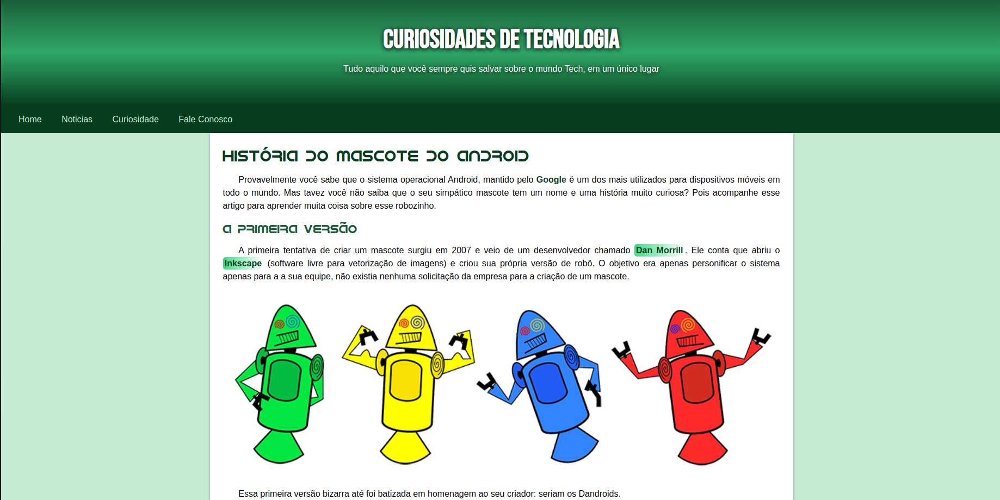
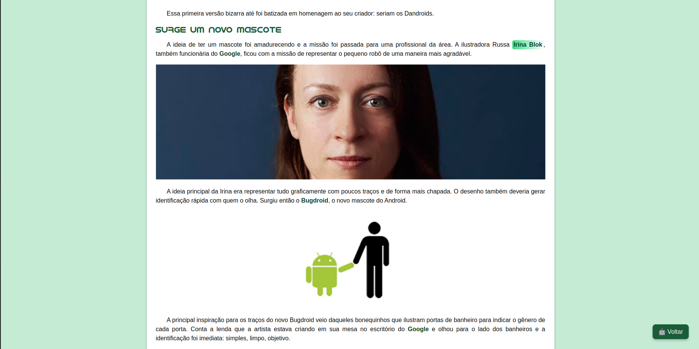
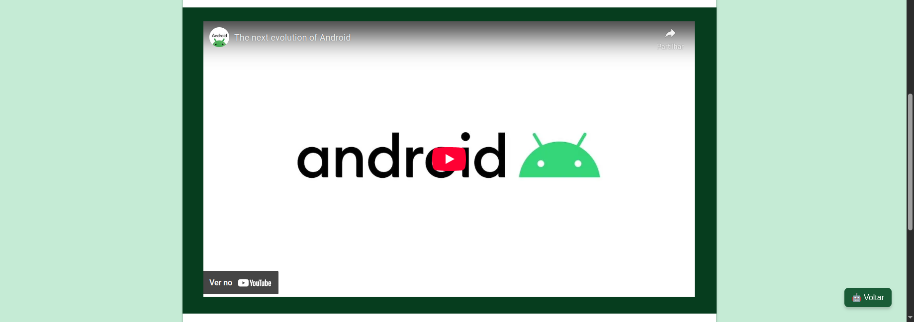
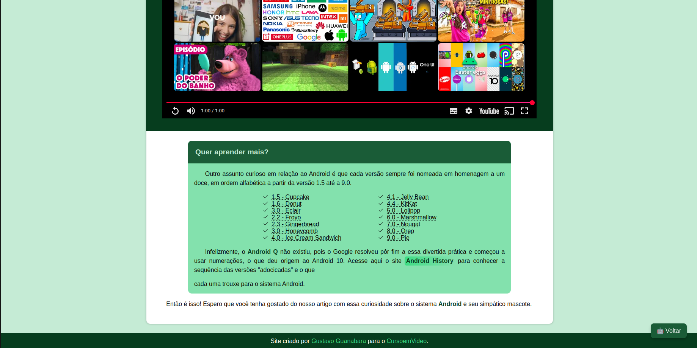

# 🤖 Curiosidades de Tecnologia

Este projeto é uma página web que apresenta a **história do mascote do Android**, desde suas primeiras versões criadas por Dan Morrill até a versão oficial conhecida como **Bugdroid**, desenvolvida por Irina Blok.

---

## 📚 Conteúdo

- História do mascote do Android
- Primeiras versões (Dandroids)
- Criação do Bugdroid
- Versões do Android nomeadas com doces
- Vídeo incorporado com a evolução do Android

---

## 💻 Tecnologias Utilizadas

- **HTML5**
- **CSS3**
- Fontes personalizadas (`Bebas Neue` e `Android`)
- Responsividade com media queries
- Ícones SVG embutidos
- JavaScript para botão de voltar ao topo

---

## 📸 Capturas de Tela

### 🖼️ Página Inicial


### 👩 Criadora Irina Blok


### 📽️ Vídeo incorporado


### 🖼️ Quer saber mais ?


/home/leandro/Imagens/Imagem colada.png
---

## 📂 Estrutura de Arquivos

```
📁 projeto/
├── index.html
├── style/
│   └── style.css
├── fontes/
│   └── idroid.otf
├── imagens/
│   ├── dan-droids.png
│   ├── irina-blok.jpg
│   ├── bugdroid.png
│   └── favicon.ico
```

---

## 👨‍🏫 Créditos

Projeto baseado nas aulas do [CursoemVídeo](https://www.cursoemvideo.com/), criado originalmente por **Gustavo Guanabara**.  
Adaptação e aprimoramento por **Leandro Eduardo Lima dos Santos**.

---

## 🔗 Acesse

Você pode clonar este projeto ou visualizá-lo diretamente no navegador após baixar os arquivos.

---

## 🚀 Como executar

1. Clone o repositório:
```bash
git clone https://github.com/leandroglima/nome-do-repo.git
```

2. Abra o arquivo `index.html` em seu navegador.

---

## 📝 Licença

Este projeto é apenas para fins educacionais.
